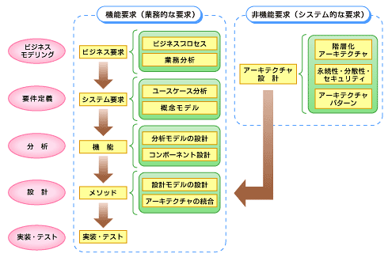
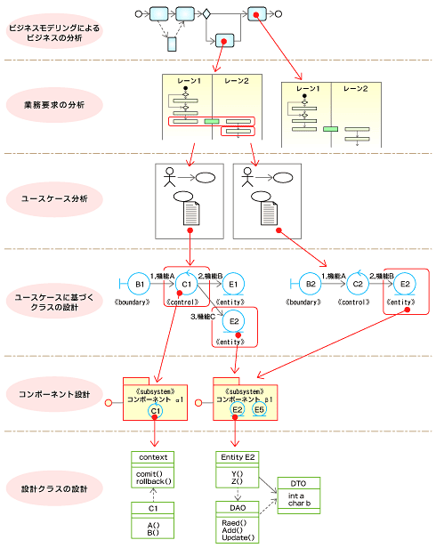

# ソフトウェアテストの勉強：テスト初心者が「ソフトウェアのテスト技法」を読んでテストを学んだ

[:contents]

タイトル通り，**ソフトウェアテストについて体系的な知識を何も持っていない**，テスト初心者である筆者がテストを学び，その内容をまとめてみた．主に「ソフトウェアのテスト技法（日経 BP）」という書籍（以降，「本書」と呼ぶ）で学んだことをまとめた．

[アフィのリンク](https://link)

「理解が間違っている」，「認識が違う」とかあれば気軽に本記事や Twitter でコメントいただけると幸いです．

## ソフトウェアテストを学ぶモチベーション

「テストなんも分からん」な状態の自分がテストを学ぶ必要があると思ったきっかけを列挙した．

- 「ソフトウェアエンジニアになりたいならテストを理解することは必要不可欠」というのを常々感じていた
- 似非テスト駆動開発（テストを書いてからロジック実装する）をしたときに体験が良かった
- 新しいプロジェクトに触れるとき，テストの実装を見ればそのプロジェクトでどんなことをするかがざっくりと理解できた体験から，テストって大事だなと感じた
  - 「ユースケースのテストを見ればそのプロダクトの使われ方が分かる」みたいな話．
  - 「テストを読んで実装を把握してくれ」という指示を受けたときに「なるほど，ドキュメントっぽい使い方もできるのか」と感心した．
- テストの体系的な学び方，特に「**どのようなテストケースを用意すれば良いか**」が分からないと常々思っていた．そんで Twitter 眺めてたら本書が流れてきて，テストケースについて体系的に学べそうだったので即ポチった．
- TL の学生エンジニアがみんな実践的なテストの話をしていて，自分も負けていられないと思った

## <a name="range">本書の扱う範囲</a>

本書は，ソフトウェアテストのプロセス全般を扱うのではなく，「**ソフトウェアテストの設計**」のみに焦点を当てている．テストの実践的な側面，特に「**テストケースの設計**」を扱っている．

簡単に言えば，JUnit（Java），pytest（Python），Jest（JavaScript）など各種プログラミング言語に備わっているテストフレームワークでテストコードの実装を行うよりも 1 段抽象度の高い段階を扱っている．（筆者のように）なんとなくテストを書く際にも，「テストの設計（どんなテストケースが必要か） -> テストの実装」という段階を無意識に踏んでいるだろう．

## 「ソフトウェアテスト」，「ソフトウェアテストの設計」の立ち位置

本書の内容に入る前に，ソフトウェアテスト，ソフトウェアテストの設計の立ち位置について確認しておく．

### ソフトウェア開発の全体像：ソフトウェア開発における「ソフトウェアテスト」の立ち位置の確認

まず，ソフトウェアテストの詳細に入っていく前に，ソフトウェア開発の全体像をざっと見通す．

ソフトウェア開発（システム開発）の工程は以下の 5 つに分けることができる．この工程の内，本記事で扱うソフトウェアテストは 5 つ目の「実装・テスト」に該当する．

1. ビジネス要求（の分析）
2. システム要求（の分析）
3. 機能（の設計）
4. メソッド（の設計）
5. 実装・テスト（の実施）（**「ソフトウェアテスト」とはここに該当**）

（引用元：[ITmedia: キミの設計に「トレーサビリティ」はあるか](https://www.itmedia.co.jp/im/articles/0802/07/news141.html)）

### ソフトウェアテストとは

引用元：[【備忘録】はじめて学ぶソフトウェアのテスト技法
](https://medium.com/@koyafukuda/%E5%82%99%E5%BF%98%E9%8C%B2-%E3%81%AF%E3%81%98%E3%82%81%E3%81%A6%E5%AD%A6%E3%81%B6%E3%82%BD%E3%83%95%E3%83%88%E3%82%A6%E3%82%A7%E3%82%A2%E3%81%AE%E3%83%86%E3%82%B9%E3%83%88%E6%8A%80%E6%B3%95-9fa6b95add6b)

**記事書くときに引用元の文章を自分用に変える**

- テスト
  - ある特定の条件下で，システムまたはコンポーネントを操作するプロセスであり，その結果を観察または記録して，システムまたはコンポーネントの側面を評価すること（IEEE 610.12–1990 により引用）
- テストケース
  - 「ある特定の条件」を具体化したものがテストケースであり，その作り方がこの本のテーマになる．有効性と効率を求めるならいい加減なテストケースを作るのではなく，設計が必要である．

### ソフトウェアテストのプロセスの全体像：「ソフトウェアテストの設計」の立ち位置の確認

ソフトウェア開発におけるソフトウェアテストの立ち位置を確認したところで，ソフトウェアテストの詳細について見ていく．ソフトウェアテストのプロセスの全体像についてまとめる．

<a href="#range">本書の扱う範囲</a>では，本書はソフトウェアテストのプロセス内，「テストの設計」を扱うと述べた．ここでは，「テストの設計」がソフトウェアテストのプロセスの内，どの段階に位置付けられているかを意識すると良い．

（働き始めたらどうせ触れるだろうから，現段階では全体像をざっと把握することに努め，各手順の詳細に触れることはしない．<s>どうせ今勉強しても実感が沸かなくて学習効果が薄い</s>．）

#### ソフトウェアテストのプロセス

日本ソフトウェア資格認定委員会（JSTQB）[^1]によれば，ソフトウェアテストのプロセスは計画からテスト結果の評価終了後の作業までを含め，以下の 7 つに手順で構成されている[^2]．[JSTQB のシラバス](http://jstqb.jp/dl/JSTQB-Syllabus.Advanced_TM_Version2012.J03.pdf)から引用している（このシラバスの p.7 ~ p.15 の「テストプロセス」の章で全体像がまとめられているため，それだけでも眺めておくと良いかも）．

1. テストの計画，モニタリング，コントロール
   - システムのテストニーズを分析して，テスト目的を達成するテスト活動およびテスト成果物を計画する．
2. テスト分析
   - **「何をテストするか」を決定する**
   - トレーサビリティを確保し，テスト目的，テスト戦略，およびテスト計画に基づいて定義されたテスト条件の完全性と一貫性をチェックする．
   - テスト条件を指定する詳細度に影響を与える可能性がある要因および，詳細にテスト条件を指定することの長所と短所について説明する．
3. **テスト設計**（本書の扱う範囲）
   - 2 で決めた「何をテストするか」について，**「どのようにテストするか」を決定する**
   - トレーサビリティを使用し，定義されたテスト条件に基づいて設計されたテストケースの完全性と一貫性をチェックする．
4. テスト実装
   - リスク、優先順位付け，テスト環境とデータ依存性，および制約を使用して，テスト目的，テスト戦略，およびテスト計画に対して完全性と一貫性のあるテスト実行スケジュールを作成する．
5. テスト実行
   - トレーサビリティを使用し，テスト目的，テスト戦略，およびテスト計画との完全性と一貫性という観点で，テスト進捗をモニタリングする．
6. 終了基準の評価とレポート
   - 終了基準に対する正確なレポート作成と評価を支援するために，テストプロセスにおける正確でタイムリーな情報収集が重要であることを説明する．
7. テスト終了作業
   - 4 つに大別されるテスト終了作業
     - テスト完了チェック
     - テスト成果物の提供
     - 学習した教訓
     - 構成管理システムで，結果，ログ，レポート，その他のドキュメント，および成果物を補完する
   - プロジェクトの振り返りを実行して，プロセスを評価し，改善する領域を発見する．

[^1]: 日本ソフトウェアテスト資格認定委員会（Japan Software Testing Qualifications Board，JSTQB）．日本におけるソフトウェアテスト技術者資格認定の運営組織．ソフトウェアテストの国際的な資格認定団体である ISTQB（International Software Testing Qualifications Bord）に加盟しているため，JSTQB が運営する資格は海外でも有効（[テストプロセスの流れと各プロセスの実施内容](https://www.qbook.jp/column/20190710_706.html)より）．
[^2]: ただし，テスト対象の規模，プロジェクトの緊急度により，一部の作業が簡略化されたり同時進行したりする場合もある．

#### 補足：用語説明

用語の補足をちょっとだけしておく（参考：[テストの設計の仕方](https://webrage.jp/techblog/design_method_of_test/)）．

- **テストベース**

  - テストケースの素材となる，テスト対象の性質や品質，特徴などを記したもの．
  - ex) 要件，アーキテクチャ，設計，インターフェース仕様など，さまざまなものがある．多くのテストベースの中から情報をまとめたり，不足しているものを足したりして，テストケースを作ります．

- **トレーサビリティ**

  - 追跡可能性．**システムの各モジュールが，システム内にどのように組み込まれているかが追跡できること**．これは仕様書や設計書などの文書にも当てはまる．ざっくり言うと，**ビジネス要求とそれに対応する実装・テストの対応が追跡できること**．
  - トレーサビリティが確保できていると嬉しいこと
    - 仕様書や設計書に変更があったとしても，テストでの変更点がすぐに判断でき，致命的な欠陥の抜け漏れを防ぐことができる．
    - 機能の設計段階では，システム要求の結果であるユースケースの定義 -> 機能の設計という変換作業を経る．このとき，入力される要求や機能が，出力される要求や機能にどのように対応するのかを追跡できると，**修正の影響範囲を特定する時に役立つ**．このため，トレーサビリティが局所化されるよう設計することも重要なポイントと言える．1 つの要求が多岐にわたる機能に変換される場合，保守性や拡張性が低くなってしまう．

- **テスト条件**
  - [TODO]
- **テスト条件の完全性と一貫性**
  - [TODO]

---

---

## ソフトウェアテストの設計

ソフトウェアテストの設計の立ち位置を把握した上で，実際に本書の内容に

---

---

## 勉強の最中に浮かんだ疑問

テストについて勉強してる最中に浮かんだ疑問（現場でがっつり開発したことがないので素人レベルの疑問だと思って見てください）．

- アジャイル開発において，テスト駆動開発等の「プロジェクト早期にテストを実装する」ような開発の進め方をした場合，イテレーションからイテレーションの間にコードが劇的に変化し，既存のテストコードが意味を為さなくなってしまう可能性があると思うが，現場ではこの問題をどのように解決しているのか？（テストの保守みたいな話？[JSTQB のシラバス](http://jstqb.jp/dl/JSTQB-Syllabus.Advanced_TM_Version2012.J03.pdf)の p.14 に書かれていた話）．
- テスト駆動開発において，テストコード自体が意味を為さなくなるような開発プロセスならテスト駆動開発は失敗してしまうでは？と思った（というかそういうテストの設計も踏まえてのテスト駆動開発かな？）．

## 感想

- ソフトウェアテストのプロセスの全体像を見て，テストの計画から完了までこんな厳密にテストって行わなければいけないの？と驚いた．自分の中では「ソフトウェアテスト＝ユニットテストのテストケースを考えて実装する」くらいの認識だった．

## これからの勉強予定

Kent Back の「テスト駆動開発」を読みたいなと考えている．
同時に，テストと密接に関わるソフトウェアの設計（クリーンアーキテクチャなど）についても学びたいなと考えている．

気長にやっていく．
